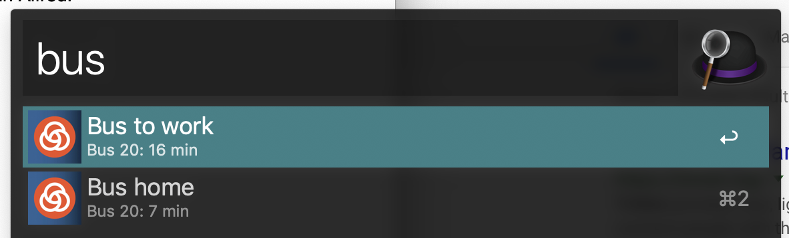

# TriMet Alfred Workflow

Fetches next TriMet bus times and displays them in Alfred.

Pressing ↵ on either of these options will take you to the [Transit Tracker](https://trimet.org/#/tracker) page for that stop.

# Installation

Either:

Download and install the latest release from [here](https://github.com/davidmerrick/Alfred-TriMet-Workflow/releases).

Or: 

1. Create a new Alfred workflow and clone this repo into it.
2. Run `npm install` to install dependencies.

# Configuration

1. Get an API key from [here](https://developer.trimet.org/appid/registration/).
2. Copy the `config.example.json` file to `config.json`. Add your API key in the `trimetApiKey` field.
3. Configure the bus stops you're interested in, and add custom labels for them. Invoke this workflow by typing, `bus`.

Happy commuting!
